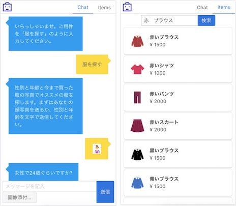
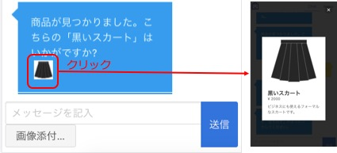

# Conversation & Visual Recognitionデモアプリ


IBM Cloudのサービスで作成できるWebアプリケーションのサンプルです。  
洋服販売サイトの一部を想定しており、チャット形式でお客様から顔写真とこれまでに買った服の写真をお送りいただき、写真から読み取った性別・年齢・服の色および種類をもとにおすすめ商品を提示します。  
写真の読み取りにはVisual Recognitionサービス、チャットのフレームワークにConversationサービスを利用しています。

図: アプリケーション画面（左： チャット画面、右： 商品一覧画面）  


- [IBM Cloudへのデプロイ](#ibm-cloudへのデプロイ)
- [アプリの操作方法](#アプリの操作方法)
- [ローカルでの起動](#ローカルでの起動)
- [Tips](#tips)

## IBM Cloudへのデプロイ
「clone or download」ボタンでソースコードをダウンロードしてご自分のPCに保存して解凍し、下記を実施します。

1. [各種サービスの追加](#1-各種サービスの追加)
2. [manifest.ymlの編集](#2-manifestymlの編集)
3. [Conversationのセットアップ](#3-conversationのセットアップ)
4. [Visual Recognitionのセットアップ](#4-visual-recognitionのセットアップ)
5. [Cloudantのセットアップ](#5-cloudantのセットアップ)
6. [/common/env/default.jsonの確認](#6-commonenvdefaultjsonの確認)
7. [デプロイ](#7-デプロイ)

#### 前提条件
- IBM Cloudのアカウントを所持していること
  * アカウントをお持ちでない方は[こちら](https://www.ibm.com/cloud-computing/jp/ja/bluemix/lite-account/)をご参照ください。

- お手持ちのPCにIBM Cloud CLIが導入されていること

### 1. 各種サービスの追加

アプリのデプロイ先となるIBM Cloudのスペースに  
SDK for Node.js、Conversation、Visual Recognition、Cloudantを追加します。

#### 1−1. SDK for Node.jsの追加

1. IBM Cloudにブラウザでログインします。
2. IBM Cloudダッシュボード内および右上のユーザーアイコンにて、アプリのデプロイ先となっているアカウントおよびスペースを選択します。
3. 画面上部メニューの「カタログ」をクリックしてカタログ画面に進みます。
4. カタログの検索フォームで「SDK for Node.js」を検索し、表示された「SDK for Node.js」をクリックします。
5. サービス追加画面が表示されるので、下記を入力します。

    - アプリ名: ホスト名と同じになります。任意のものを入力します。
    - ドメイン: アプリのデプロイ先スペースの地域と同じものを選択します。(米国南部の場合はmybluemix.netになります)
    - 地域,組織,スペース: アプリのデプロイ先であることを確認します。

6. 入力内容が正しいことを確認し、「作成」をクリックします。
7. Node.jsアプリケーション管理画面が表示されます。アプリケーションが「実行中」となるまで待ちます。

※アプリケーション管理画面はIBM Cloudダッシュボード>Cloud Foundryアプリ>(アプリ名)で表示できます

#### 1−2. Conversationの追加

1. 1−1の手順1−3と同様、IBM Cloudにブラウザでログインしてカタログ画面に進みます。
2. カタログの検索フォームで「Conversation」を検索し、「Watson」セクション内の「Conversation」をクリックします。
3. サービス追加画面が表示されるので、下記を入力します。

    - サービス名: 任意のものを入力します。
    - 地域,組織,スペース: アプリのデプロイ先であることを確認します。
    - プラン: Liteを選択します。無い場合は料金が無料のものを選択します。

4. 入力内容が正しいことを確認し、「作成」をクリックします。
5. IBM Cloudダッシュボード>Cloud Foundryアプリ>(1−1で作成したNode.jsアプリ名)からアプリケーション管理画面を開きます。
6. 左側メニューの「接続」をクリックします。接続されているサービスの一覧表が表示されるので、表の上にある「接続の作成」をクリックします。
7. 既存サービス一覧が表示されます。作成したConversationサービスの行の「Connect」をクリックします。
8. 6.の接続一覧画面を再度開き、Conversationサービスが表示されていることを確認します。

#### 1−3. Visual Recognitionの追加

1. 1−1の手順1−3と同様、IBM Cloudにブラウザでログインしてカタログ画面に進みます。
2. カタログの検索フォームで「Visual Recognition」を検索し、「Watson」セクション内の「Visual Recognition」をクリックします。
3. サービス追加画面が表示されるので、下記を入力します。

    - サービス名: 任意のものを入力します。
    - 地域,組織,スペース: アプリのデプロイ先であることを確認します。
    - プラン: Liteを選択します。無い場合は料金が無料のものを選択します。

4. 入力内容が正しいことを確認し、「作成」をクリックします。
5. 1−2の手順5以降と同様に、Node.jsアプリケーションにVisual Recognitionサービスを接続します。

#### 1−4. Cloudantの追加

1. 1−1の手順1−3と同様、IBM Cloudにブラウザでログインしてカタログ画面に進みます。
2. カタログの検索フォームで「Cloudant」を検索し、表示される「Cloudant NoSQL DB」をクリックします。
3. サービス追加画面が表示されるので、下記を入力します。

    - サービス名: 任意のものを入力します。
    - 地域,組織,スペース: アプリのデプロイ先であることを確認します。
    - プラン: Liteを選択します。無い場合は料金が無料のものを選択します 

4. 入力内容が正しいことを確認し、「作成」をクリックします。
5. 1−2の手順5以降と同様に、Node.jsアプリケーションにCloudantサービスを接続します。

### 2. manifest.ymlの編集

manifest.ymlにNode.jsのアプリケーション名およびドメインを記入します。  
下記のように編集します。

```yaml:manifest.yml
#(中略)
applications:
- path: .
  memory: 256M
  instances: 1
  domain: ドメイン
  name: アプリケーション名
  host: ホスト名(アプリケーション名と同じ)
  disk_quota: 1024M
#  env:
#    VALID_USERID: userid
#    VALID_PASSWORD: password
```

manifest.yml記入例
```yaml:manifest.yml
#(中略)
applications:
- path: .
  memory: 256M
  instances: 1
  domain: mybluemix.net
  name: ecdemoapp20180101
  host: ecdemoapp20180101
  disk_quota: 1024M
#  env:
#    VALID_USERID: userid
#    VALID_PASSWORD: password
```

### 3. Conversationのセットアップ
1. ワークスペース用JSON(/serviceSetup/conversation/workspace-conversation.json)があることを確認します。
2. Conversationのダッシュボードにてワークスペース用JSONをインポートします。
3. インポート後にワークスペースのIDが作成されるので、  
    /common/env/default.jsonの`CONVERSATION_WS_ID`の値に記入してください。

```
// ID貼り付け後のdefault.jsonの例
{
  "CONVERSATION_WS_ID": "xxxxxxxx-xxxx-xxxx-xxxx-xxxxxxxxxxxx",
  // 中略
}
```

### 4. Visual Recognitionのセットアップ

服のタイプ用と色用で２個のClassifierを作成します。

1. 画像検索サイト等で服のタイプ(スカート、パンツ、ブラウス、シャツ)および色(白、黒、赤、青、黄)のサンプルとなる画像を各種１０枚以上集めます。  
  赤いスカート10枚、等各色×各タイプを網羅するように収集します。
2. 収集した画像をタイプ毎および色ごとにzipファイルでまとめます。(赤いスカートの画像は"red_skirt.zip"、赤いシャツの画像は"red_shirts.zip"...と作成するイメージです)
3. Visual RecognitionダッシュボードでClassifierを作成します。

Classifier名は"ClothColorType"とし、  
クラスとして"服の色_服のタイプ"(いずれも英語)を網羅するよう下記を作成し、対応するzipファイルをアップロードします。

- black_blouse (黒いブラウス)
- white_blouse (白いブラウス)
- blue_blouse (青いブラウス)
- red_blouse (赤いブラウス)
- yellow_blouse (黄色いブラウス)
- black_pants (黒いパンツ)
- white_pants (白いパンツ)
- blue_pants (青いパンツ)
- red_pants (赤いパンツ)
- yellow_pants (黄色いパンツ)
- black_shirts (黒いシャツ)
- white_shirts (白いシャツ)
- blue_shirts (青いシャツ)
- red_shirts (赤いシャツ)
- yellow_shirts (黄色いシャツ)
- black_skirt (黒いスカート)
- white_skirt (白いスカート)
- blue_skirt (青いスカート)
- red_skirt (赤いスカート)
- yellow_skirt (黄色いスカート)

4. Visual RecognitionダッシュボードでClassifierの名前の下ににclassifierのIDが表示されます。  
    /common/env/default.jsonの`VISUAL_RECOGNITION_CLASSIFIERS`内に下記のように記入してください。

```
// ID貼り付け後のdefault.jsonの例(一部)
  "VISUAL_RECOGNITION_CLASSIFIERS": {
    "CLOTH_COLOR_TYPE": "服の色およびタイプ用ClassifierのID"
  },
```

```
// ID貼り付け後のdefault.jsonの例(一部)
  "VISUAL_RECOGNITION_CLASSIFIERS": {
    "CLOTH_COLOR_TYPE": "ClothColorType_820602790"
  },
```

### 5. Cloudantのセットアップ

1. ダッシュボード>database>ecsitedb でDB管理画面を開き、「Create Document」をクリックします。
2. /serviceSetup/cloudant/cloudant_index.json(index用JSON)をコピー&ペーストし、「Create Document」をクリックして文書を保存してください。
3. 先ほどの1.の画面を再度表示し、画面の「All Documents」以下に「item」が表示されることを確認します。
4. 上記「item」の左側三角アイコンをクリックすると「itemSearch」が表示されることを確認します。

※DB名を変える場合は、/common/env/default.jsonの`DB_NAME`の値をDB名と同じになるよう変更してください。
※index用文書およびindexの名前を変える場合は上記default.jsonの `DB_INDEX.SEARCH_ITEM` の値を変更してください。

```
  "DB_NAME": "ecsitedb", // DB名と同じ
  "DB_INDEX": {
    "SEARCH_ITEM": {
      "designDocName": "item", // index用文書名と同じ
      "indexName": "itemSearch" // index名と同じ
    }
  },
```

5. (オプション)商品情報を編集する場合は、/serviceSetup/cloudant/itemDoc/item_list.jsonを編集し、  
商品画像をpublic/images/item-images内に配置します。

item_list.jsonには複数の商品情報用文書の内容が含まれています。(「{」から「}」が商品１個分です)  
アプリ起動時に自動で読み込まれ、Cloudantに保存されます。既に_idが同じ文書が存在する場合は保存されません。

/serviceSetup/cloudant/itemDoc/item_list.jsonは下記のような状態になっています。

```
[
  {
    "_id": "item_00000001", // Cloudantの文書ID
    "name": "黒いブラウス", // 商品名
    "color": "黒", // 色
    "type": "ブラウス", // 服のタイプ
    "price": 1500, // 価格(数値)
    "description": "フォーマルにおすすめの黒いブラウスです。", // 商品説明
    "maxAge": 100, // 対象年齢上限(数値)
    "minAge": 0, // 対象年齢下限(数値)
    "docType": "ITEM", // 文書の種類(商品情報であることを示す「ITEM」)
    "image": "images/item-images/black_blouse.jpg"  // 商品画像(public/images/item-images内)へのリンク
  },
  // 中略
]
```

### 6. /common/env/default.jsonの確認

記入したワークスペース名等を再度確認します。

```
{
  "CONVERSATION_WS_ID": "xxxx-xxx-xxxx-xxxx-xxxxxxx", // Conversationのワークスペース名
  "VISUAL_RECOGNITION_CLASSIFIERS": {
    "CLOTH_COLOR_TYPE": "ClothColorType_xxx" // Visual Recognitionの色および服タイプ用ClassifierのID
  },
  "DB_NAME": "ecsitedb", // DB名
  "DB_INDEX": {
    "SEARCH_ITEM": {
      "designDocName": "item", // index用文書名
      "indexName": "itemSearch" // index名
    }
  },
  "LOG_LEVEL": "info" // ログレベルのため変更不要(debug,info,warn,errorのいずれかを記入)
}
```

### 7. デプロイ

1. お手持ちのPCにIBM Cloud CLIをインストールします。
2. コマンドプロンプトまたはターミナルを開きます。
3. 下記コマンドでこのソースコードのファイルに移動します。

```
cd このディレクトリ
```

4. 下記コマンドでIBM Cloudにログインします。  
ユーザー名やパスワードの入力プロンプトが表示されるので、順次入力します。  
このとき、組織およびスペースがアプリのデプロイ先になるようにします。

```
bx login
```


5. 下記コマンドで組織およびスペースがアプリのデプロイ先であるか再度確認します。

```
bx target
```

表示例

```
API エンドポイント:   https://api.ng.bluemix.net (API バージョン: 2.92.0)   
地域:                 us-south   
ユーザー:             tom@example.com   
アカウント:           Tom's Account (xxxxxx)   
リソース・グループ:   default   
組織:                 tom@example.com   
スペース:             dev   
```

6. 下記コマンドでアプリのデプロイを開始します。

```
bx app push
```

7. デプロイ処理の進捗が表示されます。正常にデプロイが完了すると「アプリが開始しました」と表示され、コマンドのプロセスが終了します。

## アプリの操作方法
WebブラウザでアプリのURLにアクセスします。  
画面上部のタブでチャット画面と商品一覧画面を切り替えることができます。

#### チャット画面
画面下部に送信フォームがあります。  
テキストの場合はテキストフォームに入力、画像の場合は「画像添付」ボタンをクリックして画像を選択し、  
「送信」をクリックします。  
(モバイルの場合、画像添付ボタンを押した後に写真撮影に進みます。)

おすすめ商品が画像付きで提示された場合は、画像をクリックすると商品情報がダイアログで表示されます。



#### 商品一覧画面
タブを開いた直後は検索フォームのみ表示されます。  
検索フォームに"青 シャツ" 等商品の検索条件を入力し、「検索」をクリックするとヒットした商品が表示されます。  
(検索フォームが空欄のまま検索をクリックした場合は全商品が表示されます。)

表示されている商品をクリックすると商品情報がダイアログで表示されます。

## ローカルでの起動

ConversationなどのサービスをIBM Cloudで作成した後、  
Node.jsアプリ部分のみローカルPCで起動する手順です。

1. PCに下記モジュールをインストールします。
    - Node.js (6 - 8) および npm

2. IBM Cloudにデプロイする場合と同様に、Conversation、Visual Recognition、Cloudantをセットアップしてcommon/env/default.jsonを更新します。
3. IBM Cloudダッシュボード>各サービスの管理画面にて、左メニュー「サービス資格情報」をクリックします。
4. サービス資格情報で「資格情報の表示」をクリックし、username等をcommon/env/VCAP_SERVICES.jsonに記入します。
5. コマンドプロンプトやターミナル等で下記を実行します(xxx installコマンドは１回実施すれば次回起動時は不要です。)

```
cd <このディレクトリ>
npm install
```

5. 下記を実行してアプリを起動します。  
※必ずこのディレクトリに移動した状態(`cd このディレクトリ`を実行した後)で起動してください。

```
node app
```

6. 「Server starting on http://127.0.0.1:3000 」等と表示されたら、ブラウザでそのURLを開きます。
7. 停止する場合はCtrlキーとCキーを同時に押します。


## Tips

### BASIC認証有効化

manifest.ymlの#env:以下(アプリ稼働環境の環境変数になります)を下記のように変更すると、  
アプリケーションにBASIC認証をかけることができます。  
アプリケーションのURLにアクセスするとユーザー名およびパスワード入力プロンプトが表示されるようになり、  
ymlに記入した値を入力した場合のみアプリケーションにアクセスできるようになります。

- ユーザー名: VALID_USERIDの値(下記の例ではuserid)  
- パスワード: VALID_PASSWORDの値(下記の例ではpassword)  

```yaml:manifest.yml
#(中略)
  disk_quota: 1024M
  env:
    VALID_USERID: userid
    VALID_PASSWORD: password
```

※ BASIC認証を有効化した後再度無効にする場合は、  
IBM Cloud のアプリ管理画面>ランタイム>環境変数にて  
環境変数VALID_USERIDおよびVALID_PASSWORDを削除して下さい  
(削除後にアプリケーションが再起動されます)


